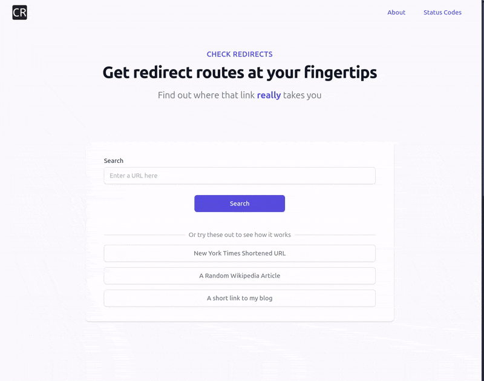

# Check Redirects

> Find all hops along the way to resolving a URL.

Check Redirects is designed to ensure you go from A to B when resolving a URL, identifying any redirects along the way.
Instantly resolve the final URL without needing to follow the redirect chain manually. Circumvent malicious redirects,
ad-tech, affiliates, and more. Use it to identify if your redirects or affiliates are working as intended.



## Architecture

A [PocketBase] application that uses a React frontend, all served from a single binary.

When provided a URL, Check Redirects will resolve all the hops in the redirect chain and return the final URL.

SQLite is used as the database for storing the resolved URLs. The data is not persisted between restarts, and this is
intentional. Data is merely a cache for faster lookups of duplicate URLs. Each search query and the hops are stored in
the database for 72 hours before being deleted, or until the application is restarted.

Typically, queries are done via the frontend, but the API is also available for use in other applications.

To make an API query from the command line, use the `curl` command:

```bash
curl https://check-redirects.com/api/search \
  -d '{"url": "tars.run/XwsxjYVI32g"}' \
  -H "Content-Type: application/json"
```

### How it Works

A simplified sequence diagram of the application's flow:


## Setup

This application is a Go application that uses a React frontend. The frontend is embedded in the Go binary.

To get started, we suggest using, [task] to manage the lifecycle of the application including
development,
and building the binary.

```bash
# Run the frontend and backend together
task dev
# Run the pocketbase server only
task api
# Run the frontend only
task ui
```
## Requirements

- [Go]
- [air]
- [pnpm]
- [task] (optional but recommended)

## Development

In development, you can run the frontend and backend together using the `dev` task. Or you can run the frontend or
backend individually using the `ui` or `api` task. 

[air] is used to hot-reload changes. When using `task dev`, any change will trigger a 
rebuild and reload of the frontend as well as the backend.

When using the `ui` or `api` tasks, you will need to run the frontend and backend separately. `api` will also be hot-reloaded
by `air`. `task ui` will hot-reload the frontend using vite's inbuilt hot-reload, the equivalent of `pnpm run dev`.

Any additional changes to the data model must be accompanied by a migration.

## Deployment

A `Dockerfile` is provided for building the application. However, <https://check-redirects.com> is currently hosted on [Coolify]
as a docker container. All other deployment methods are currently untested.

### Required Environment Variables

- `SUPERUSER_EMAIL`: The email address of the superuser for logging into the admin panel.
- `SUPERUSER_PASSWORD`: The password of the superuser for logging into the admin panel.

Without these the application will not be able to start. This is to prevent the application from being exposed to the
public internet with admin user registration page enabled.

[go]: https://go.dev/doc/install
[task]: https://taskfile.dev/
[air]: https://github.com/air-verse/air
[pnpm]: https://pnpm.io/
[Coolify]: https://coolify.io/
[PocketBase]: https://pocketbase.io/